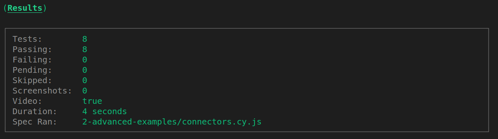

<p align="center">

<p/>

## Sumário

- [Sobre](#sobre)
- [Extensões úteis](#extensoes)
- [Instalando e executando](#instalando)

## Sobre <a name = "sobre"></a>

O app tem como objetivo dar suporte ao trabalho dos funcionários do complexo esportivo da UFCG, e facilitar a vida dos usuários das quadras da UFCG que agendam seus horários.

## Extensões úteis <a name = "extensoes"></a>

- [Prettier](https://marketplace.visualstudio.com/items?itemName=esbenp.prettier-vscode)
- [Eslint](https://marketplace.visualstudio.com/items?itemName=dbaeumer.vscode-eslint)
- [CSS Modules](https://marketplace.visualstudio.com/items?itemName=clinyong.vscode-css-modules)
- [Prettier ESLint](https://marketplace.visualstudio.com/items?itemName=rvest.vs-code-prettier-eslint)

Com essas extensões instaladas, você precisa ter as seguintes configurações no seu vscode:

- Aperte `Ctrl + Shift + P` e digite `Preferences: Open Settings (JSON)`

Cole o seguinte conteúdo:

```json
"editor.codeActionsOnSave": {
  "source.fixAll.eslint": true
},
"editor.formatOnSave": true,
"editor.defaultFormatter": "rvest.vs-code-prettier-eslint",
```

Ao salvar os arquivos, eles devem ser formatados automaticamente.

## Instalando e executando <a name = "instalando"></a>

Se for a primeira vez que está executando o projeto, instale as dependências com o comando:

```bash
npm install
```

Instale o husky no seu projeto:

```bash
npx husky install
```

Sempre que for executar o projeto, execute o comando:

```bash
npm run dev
```

O site estará disponível em [http://localhost:3000](http://localhost:3000).

## Testando o app

Primeiro o site deve estar rodando.

```bash
npm run dev
```

Em seguida, basta rodar o testes do cypress.

```bash
npm run tests
```

Se seu teste teve sucesso você verá algo como isso:


